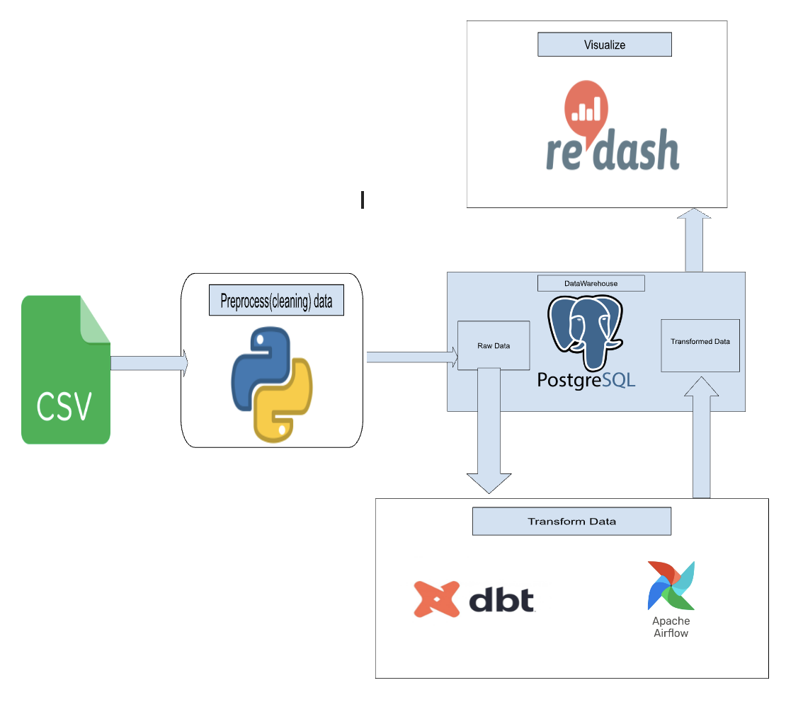

# 10academy-week2-Traffic-Analysis

Reusable Modular ELT(Extract Load Transform) project for the traffic analysis data consisting of a warehouse using Postgresql, DBT(Data Build Tool) and Airflow.

To read a blog post I wrote about this project, please visit [here](https://medium.com/@abdimussa87/creating-a-data-engineering-pipeline-for-the-pneuma-dataset-f872b4fa2b26)

## Tech-Stack



The CSV data first passes through a data processing (cleaning) part with the help of
Python. Here empty values, incorrect data types, repeating columns will be processed
to a structured format. Then it’ll be loaded to the data warehouse (database). Then
transformation will be done by DBT on the data at a scheduled time set by Airflow.
Airflow DAGs (Directed Acyclic Graphs) are created to define the workflow, specifying
the order of execution for tasks like data extraction, dbt processing, and loading into the
warehouse. Finally, Redash will help us create a dashboard by querying the
transformed data from the warehouse.

<!--  -->

## Data

The data used can be found from [here](https://open-traffic.epfl.ch/index.php/downloads/#1599231663903-a989d87d-e58d).

You can find the live DBT dashboard with generated lineage-graphs from [here](https://pneuma-traffic-analysis.netlify.app/).

## Installation

You'll need to install the packages using:

```bash
pip install -r requirements.txt
```

Then you'll need to initialize airflow using:

```bash
export AIRFLOW_HOME=`pwd`
airflow db init
airflow users create --username username --firstname firstname --lastname lastname --role Admin --email email@domain.com
airflow webserver --port 8080
```

Then you can start airflow scheduler using:

```bash
airflow scheduler
```

## Usage

- Check the notebooks folder for the initial view of the csv data
- Go to 0.0.0.0:8080 to access airflow ui

## License

MIT License

## References

[Installing dbt](https://docs.getdbt.com/dbt-cli/installation/#pip)  
[Videos on dbt](https://www.youtube.com/playlist?list=PLy4OcwImJzBLJzLYxpxaPUmCWp8j1esvT)
